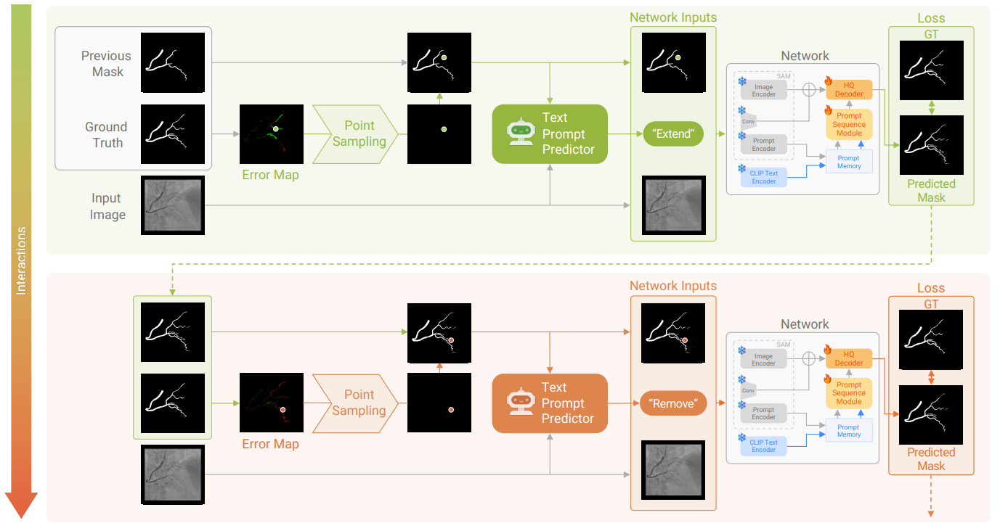

# 🧠 Multimodal Prompt Sequence Learning for Interactive Segmentation of Vascular Structures

**MICCAI 2025**
🔗 [Paper Link](https://papers.miccai.org/miccai-2025/paper/5230_paper.pdf)
---

## 📌 Overview

<p align="center">
  
</p>

This repository provides the official implementation of the paper:

> **Multimodal Prompt Sequence Learning for Interactive Segmentation of Vascular Structures**

We propose a novel interactive segmentation framework designed specifically for **complex vascular structures** in medical images.
Our method leverages **sequences of multimodal prompts (points + text)** to improve segmentation accuracy and robustness.

---

## 📝 Abstract (Summary)

Interactive segmentation is crucial for accurately delineating complex structures such as blood vessels. However, existing methods—especially those relying on single prompts (e.g., one point or one text input)—often fail to effectively correct segmentation errors.

In this work, we introduce a **multimodal prompt sequence learning framework** that:

* Combines **point prompts and text prompts** (dual-mode interaction)
* Learns from **sequences of prompts**, rather than isolated inputs
* Captures **interactions between prompts** to better guide segmentation refinement

Our approach significantly improves segmentation performance across multiple vascular datasets, while reducing critical failure cases and providing more stable results across different imaging modalities.

---

## ⚙️ Training Pipeline

### 🔹 1. Pre-training the Segmentation Model (Backbone)

* Fine-tune:

  * Image encoder
  * HQ decoder
* Input:

  ```
  {I, M_cls, p_cls, t_cls}
  ```
* Supervision:

  ```
  M_GT
  ```

#### ▶️ Run

You can train the model using the following command:

```bash
python3 train.py \
  --train_stage "train_backbone" \
  --encoder "vit_l" \
  --exp_name "exp1_train_backbone" \
  --vis 100 \
  --vis_val 100 \
  --gpu_device 0 \
  --epoch 100 \
  --val_freq 1 \
  --b 1 \
  --lr 1e-5 \
  --out_size 256 \
  --model-type "vit_l" \
  --data_path "path/to/firefly" \
  --dataset "firefly" \
  --sam_ckpt "sam_weights/sam_vit_l.pth"
```
```

---

### 🔹 2. Training the Text Prompt Predictor (TPP)

* Freeze:

  * Backbone encoder
* Train:

  * Text predictor
* Input:

  ```
  {I, M_cls, p_cls}
  ```
* Supervision:

  ```
  t_cls
  ```

#### ▶️ Run

Example command for training the **Text Prompt Predictor (TPP)**:

```bash
python3 train.py \
  --train_stage "train_tpp" \
  --encoder "vit_l" \
  --exp_name "exp1_train_tpp" \
  --vis 100 \
  --vis_val 100 \
  --gpu_device 0 \
  --epoch 100 \
  --val_freq 1 \
  --b 1 \
  --lr 1e-5 \
  --out_size 256 \
  --model-type "vit_l" \
  --data_path "path/to/firefly" \
  --dataset "firefly" \
  --weights "path/to/pretrained_backbone_weights" \
  --decoder_path "sam_weights/sam_vit_l_maskdecoder.pth" \
  --num_cls 5
```

---

### 🔹 3. Training the Prompt Sequence Module (PSM)

* Freeze:

  * Backbone encoder

* Train:

  * Prompt Sequence Module (PSM)

* Fine-tune:

  * HQ decoder

* Input sequence:

  ```
  D = {I, M_k, p_k, t_k},  k = 0, ..., K-1
  ```

* Definitions:

  * `M_k`: segmentation result from previous step
  * `p_k`: point of the largest error region (difference between M_k and M_GT)
  * `t_k`: text prompt predicted by TPP

* Supervision:

  ```
  M_GT
  ```

#### ▶️ Run

Example command for training the **Prompt Sequence Module (PSM)**:

```bash
python3 train.py \
  --train_stage "train_psm" \
  --encoder "vit_l" \
  --exp_name "exp1_train_psm" \
  --vis 100 \
  --vis_val 100 \
  --gpu_device 0 \
  --epoch 100 \
  --val_freq 1 \
  --b 1 \
  --lr 1e-5 \
  --out_size 256 \
  --model-type "vit_l" \
  --data_path "path/to/firefly" \
  --dataset "firefly" \
  --weights "path/to/trained_backbone_weights_from_stage1" \
  --tpp_weights "path/to/trained_text_predictor_weights_from_stage2" \
  --num_cls 5
```

---

## 📊 Evaluation

Evaluate the trained model using the following command:

```bash
python3 eval.py \
  --eval \
  --encoder "vit_l" \
  --exp_name "eval_firefly" \
  --vis_val 1 \
  --gpu_device 0 \
  --b 1 \
  --out_size 256 \
  --model-type "vit_l" \
  --data_path "path/to/firefly" \
  --dataset "firefly" \
  --weights "path/to/final_trained_model_weights_from_stage3" \
  --num_cls 5
```

---

## 📁 Project Structure (Example)

```
.
├── train.py # Main training script
├── eval.py # Evaluation script
├── cfg.py # Argument parser and training configuration
├── datasets/ # Dataset classes and preprocessing code
├── raw_data/ # Place your raw training data here
├── logs/ # Training logs, saved weights, and visualization results
├── models/
│ └── sam/ # Model-related implementation (SAM-based modules)
└── README.md
```

---

## 📌 Notes

* Training must be performed **sequentially (Stage 1 → 2 → 3)**
* Pretrained weights from previous stages are required for the next stage
* Ensure dataset paths are correctly configured in `cfg.py`
* For the ARCADE dataset, set `--out_size` to **512** and `--num_cls` to **4**

---

## 📜 Citation

If you find this work useful, please consider citing:

```bibtex
@inproceedings{yourname2025multimodal,
  title={Multimodal Prompt Sequence Learning for Interactive Segmentation of Vascular Structures},
  author={Lim, Jongsoo AND Lee, Soochahn},
  booktitle={MICCAI},
  year={2025}
}
```

---

## 📬 Contact

For questions or issues, please open an issue or contact the authors.

---
